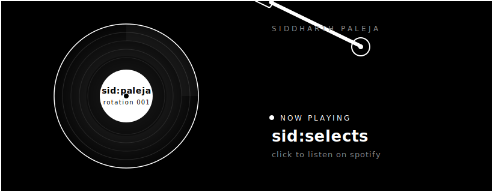

[README.md](https://github.com/user-attachments/files/30067032/README.md)

  

# sid:paleja

Product-minded engineer. CS student at UC Riverside, class of 2027. I work across product management, growth, and technical development: talk to users, define the roadmap, ship the code.

[email](mailto:siddharthpaleja@gmail.com) · [linkedin](https://www.linkedin.com/in/siddharth-paleja-48612b1b4/) · [github](https://github.com/sidpaleja11)

---

## sid:experience

**Metafloor.ai** · Software Engineering Intern · Jan 2026 to Present

- Led production rollout of a multi-level, role-based access system for enterprise customers
- Building an AI RAC Analysis Agent that visualizes quality data, improving analysis speed 30%
- Shipped an AI ticketing agent on the OpenAI SDK

**Captus.ai** · Product Management and SWE Intern · May 2025 to Nov 2025

- Built an AI knowledge platform with a dual vector database RAG pipeline across 140+ data sources
- Improved answer quality 45%
- Shipped 6 customer-facing features in React, Next.js, and TypeScript
- Cut page latency 280ms and lifted engagement 37%
- Built Outlook and Chrome add-ins to automate document ingestion

**Revelen.ai** · Technical Product Management Intern · Jun 2024 to Sept 2024

- Defined roadmaps and user stories for forensic software using the Align Framework
- Led validation across 700+ test cases
- Shipped a focus gate feature, improving hardware accuracy up to 90%
- Supported computer vision work that raised detection accuracy 40%

---

## sid:projects

**[Clerq](https://github.com/sidpaleja11/Clerq_cpa)** · Co-Founder

- AI platform automating non-billable work for solo CPAs and insurance firms
- TypeScript, Next.js, Tailwind, Python, Supabase, Auth0, Claude API

**[Harmonizer](https://github.com/sidpaleja11/opensource_dj_harmonic_mix)** · Founder

- Open source tool that extracts BPM and key from a music library
- Ranks harmonically compatible transitions on the Camelot wheel
- Adding an agentic middleware layer for autonomous compute
- Python, Librosa, FastAPI, SQLite, React, TypeScript

**[UniConnect](https://github.com/tanishajha0608/UniConnect)** · Co-Founder

- Student-focused rideshare safety app for web and mobile
- End-to-end automation for ride scheduling and data cleanup
- Next.js, TypeScript, React Native, GCP, Supabase

---

## sid:leadership

- President and Co-Founder, Product Management Club at UCR. Founded and scaled a 50+ member org
- Runs product workshops, case competitions, and industry speaker events
- ACM at UCR, web developer and UI/UX. Shipped 3+ client web apps in React and Next.js
- Sigma Phi Epsilon, VP of Finance. Manages chapter budget and financial analysis

---

## sid:skills

**product:** Agile · Scrum · Roadmapping · User Stories · Product Discovery · Figma

**languages:** Python · TypeScript · JavaScript · Java · C++ · SQL

**frameworks and cloud:** React · Next.js · React Native · FastAPI · AWS · Azure · GCP · Docker · Kubernetes · Supabase · Auth0

**certifications:** Certified Scrum Product Owner · CompTIA Security+ · CompTIA Tech+ · Claude Partner Network

**education:** B.S. Computer Science, UC Riverside · Expected March 2027
